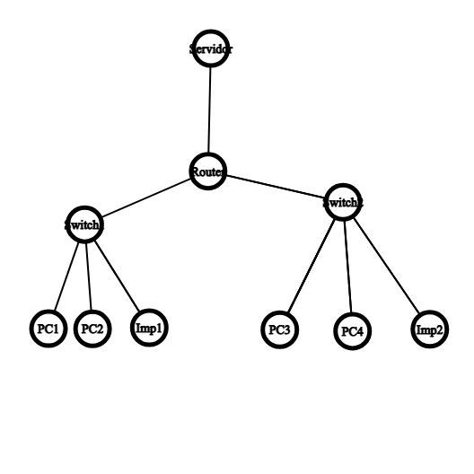
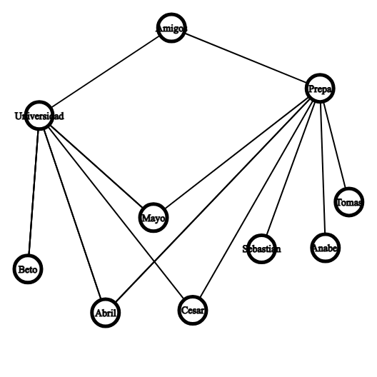

Tarea 1.2: Modelado de Grafos
Información

Nombre:Reynaldo Sanchez Perez

Fecha: 05/Diciembre/2025

Ejercicio 1:

En este ejercicio se modelaron los vuelos entre varias ciudades mediante un grafo dirigido y ponderado, donde cada arista representa un vuelo de ida y su precio. Se calcularon los grados de entrada y salida de cada ciudad, se identificó que México es la ciudad con más vuelos salientes, se determinó que la ruta más barata de México a Miami es México → Cancún → Miami (costo total $5000) y se encontró un ciclo formado por México → Cancún → Miami → México.

Ejercicio 2:

Se representó la red de una oficina mediante un grafo simple. La red tiene 10 vértices y 9 aristas, por lo que sí es un árbol (cumple n−1 aristas). Además, se determinó que el grafo es conexo, pero si el Router falla, la red se divide en 3 componentes:

Servidor

Switch1 con PC1, PC2 e Impresora1

Switch2 con PC3, PC4 e Impresora2

El dispositivo más crítico es el Router, ya que su falla desconecta toda la red en múltiples partes.

Ejercicio 3:

Se modeló una situación real: organizar una fiesta con amigos de Prepa y Universidad. Cada vértice representa a un amigo y las aristas indican si se conocieron en Prepa o Universidad. Se calcularon los grados de cada vértice, mostrando que Prepa y Universidad tienen grado alto, y que amigos como Mayo, César y Amigo tienen grado 2.
El grafo es conexo porque todos los amigos están conectados a alguno de los dos grupos principales, y sí existen ciclos. También se formuló una pregunta interesante: ¿quiénes se mantuvieron como amigos después de la preparatoria?

